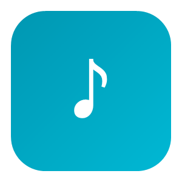
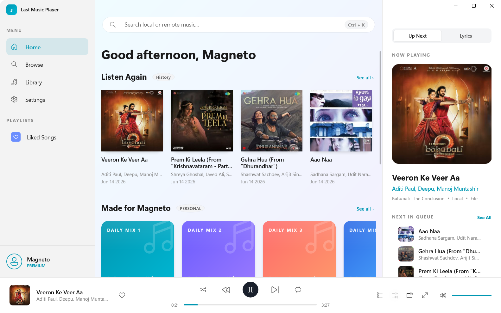
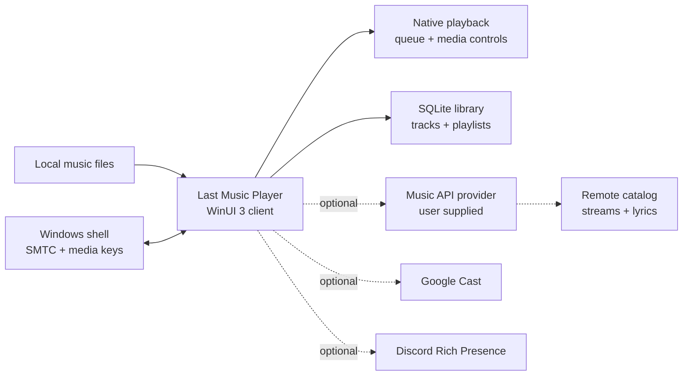

<div align="center">
  

  <h1>Last Music Player</h1>

  <p>
    <strong>A fast native Windows music player for local libraries, with optional remote playback through your own Music API.</strong>
  </p>

  <p>
    Offline playback comes first. Remote search, radio, lyrics, and imports stay behind a small provider contract you control.
  </p>

  <p>
    
    
    
    
    
    
  </p>

  <p>
    <a href="../../releases/latest">
      
    </a>
  </p>

  <p>
    <a href="#quick-start">Quick Start</a> -
    <a href="#features">Features</a> -
    <a href="#architecture">Architecture</a> -
    <a href="#music-api-provider">Music API Provider</a> -
    <a href="#development">Development</a> -
    <a href="#license">License</a>
  </p>
</div>

<p align="center">
  
</p>

> [!NOTE]
> This repository ships the Windows client only. Without a configured Music API provider, Last Music Player remains a fully functional local music player; remote features simply stay unavailable.

## Quick Start

Requirements:

- Windows 10 2004+ or Windows 11
- Visual Studio 2022 with C++ desktop development tools
- Windows App SDK workload
- Windows 11 SDK

Build and run:

1. Open `Last Music Player.slnx` in Visual Studio.
2. Restore NuGet packages if Visual Studio does not do it automatically.
3. Build `x64` in `Debug` or `Release`.
4. Launch `Last_Music_Player.exe` from the build output.

The app is configured for self-contained deployment, so the Windows App SDK runtime DLLs ship beside the executable.

## Features

- Scan and play a local music library.
- Browse by songs, albums, artists, and genres.
- Build manual playlists and use auto-generated mixes.
- Queue tracks, play next, shuffle, repeat, and resume smoothly.
- Equalizer controls are visible but disabled while the audio effect is being refined.
- Show time-synced lyrics when a Music API provider is configured.
- Integrate with Windows media keys, SMTC, and the volume flyout.
- Use optional Discord Rich Presence and Google Cast output.
- Store the library locally in SQLite.

## Architecture



Project layout:

```text
App.xaml*                  App startup and shell wiring
MainWindow/                WinUI views, player UI, search, library, settings
Backend/                   Playback, database, Music API client, playlists
Frontend/                  Navigation and UI helpers
Assets/ Styles/ Resources/ Icons, themes, and app resources
ThirdParty/sqlite/         Vendored SQLite amalgamation
installer/                 Inno Setup packaging script
tests/native/              Native helper tests
```

## Music API Provider

Remote features are intentionally client-side only in this repository. Search, streaming, radio, lyrics, and link import expect an external provider that implements the small HTTP contract in [`PROVIDER_API.md`](PROVIDER_API.md).

To enable remote playback:

1. Run a provider that implements the documented endpoints.
2. Open **Settings -> Provider** in the app.
3. Enter the provider base URL and API key.

Your provider decides how identifiers are resolved, how auth works, and where audio comes from. The public client only knows the generic Music API contract.

## Development

Useful commands:

```powershell
tools\Run-NativeProviderHelperTests.ps1
```

For command-line builds, use the Visual Studio MSBuild toolchain and build the `x64` platform:

```powershell
MSBuild.exe "Last Music Player.vcxproj" /t:Build /p:Configuration=Release /p:Platform=x64
```

The release output is written to:

```text
x64/Release/Last_Music_Player.exe
```

## Optional Private Config

Some integrations use developer-specific IDs that are intentionally not committed. To enable them in your own builds, copy:

```text
Backend/AppSecrets.example.h
```

to:

```text
Backend/AppSecrets.local.h
```

Then fill in the values you need. The local file is gitignored.

Currently supported:

- `LMP_DISCORD_CLIENT_ID` - Discord application ID for Rich Presence. If omitted, Rich Presence is disabled.

## Packaging

An [Inno Setup](https://jrsoftware.org/isinfo.php) script is included under `installer/` for creating a single-file Windows installer.

## License

This project is **source available**, not open source. It is licensed under the
custom [Last Projects License 1.0](LICENSE).

- Installing or using a release also requires acceptance of the
  [Last Projects End-User Terms](TERMS.txt).
- Contributions require acceptance of the
  [Last Projects Individual Contributor License Agreement](CLA.md).
- Natural persons may use, study, build, and modify it for strictly personal,
  noncommercial purposes.
- Modified source must be published in a qualifying public repository within
  seven calendar days.
- Companies, employers, nonprofits, schools, government bodies, and every other
  organization require a separate written license.
- Commercial use, private derivatives, binary redistribution, and AI training
  or dataset use are not permitted without written permission.

Third-party components remain under their own terms, listed in
[`THIRD-PARTY-NOTICES.txt`](THIRD-PARTY-NOTICES.txt).

Commercial and organization licensing: **info@lastprojects.com**
